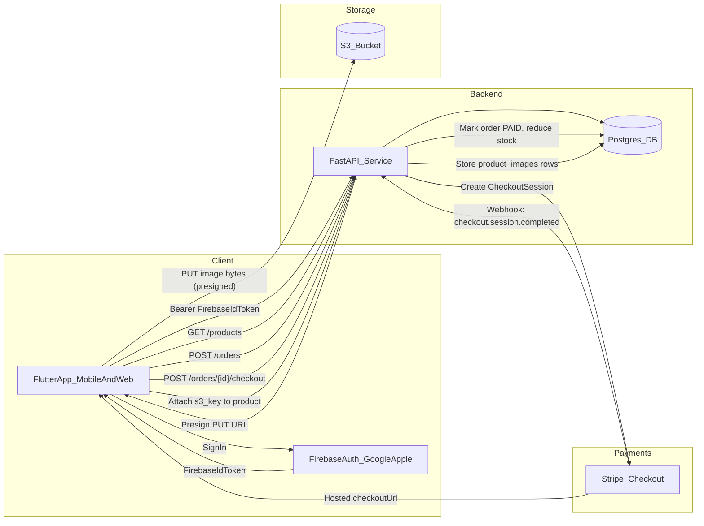
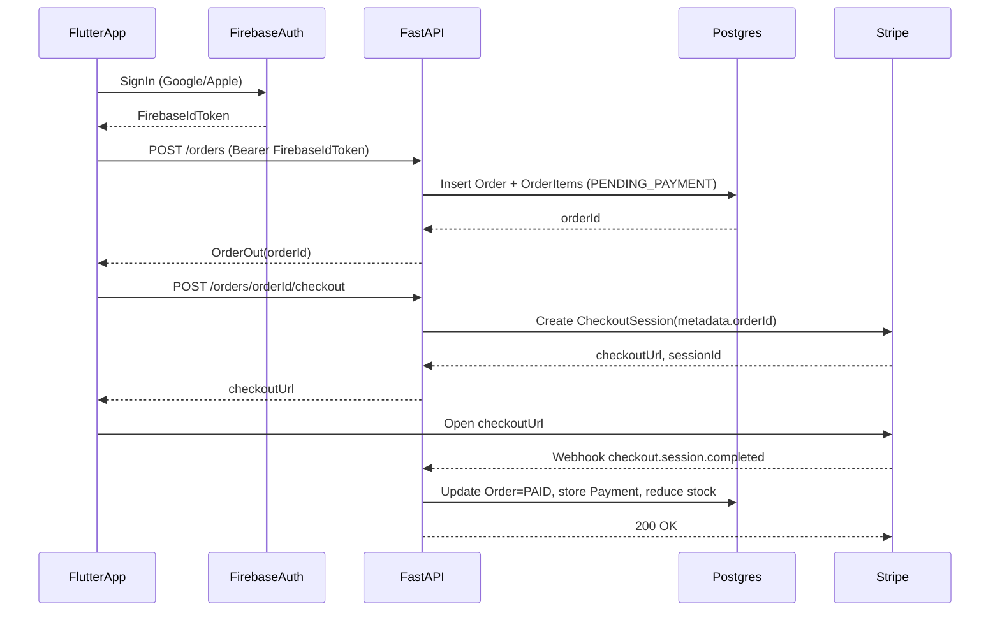

# System big picture diagrams (Marketplace V2)

## Components diagram

```mermaid
flowchart LR
  subgraph Client [Client]
    FlutterApp[FlutterApp_MobileAndWeb]
    FirebaseAuth[FirebaseAuth_GoogleApple]
  end

  subgraph Backend [Backend]
    FastAPI[FastAPI_Service]
    Postgres[(Postgres_DB)]
  end

  subgraph Storage [Storage]
    S3[(S3_Bucket)]
  end

  subgraph Payments [Payments]
    Stripe[Stripe_Checkout]
  end

  FlutterApp -->|"SignIn"| FirebaseAuth
  FirebaseAuth -->|"FirebaseIdToken"| FlutterApp

  FlutterApp -->|"Bearer FirebaseIdToken"| FastAPI
  FastAPI --> Postgres

  FlutterApp -->|"GET /products"| FastAPI
  FlutterApp -->|"POST /orders"| FastAPI
  FlutterApp -->|"POST /orders/{id}/checkout"| FastAPI

  FastAPI -->|"Create CheckoutSession"| Stripe
  Stripe -->|"Hosted checkoutUrl"| FlutterApp

  Stripe -->|"Webhook: checkout.session.completed"| FastAPI
  FastAPI -->|"Mark order PAID, reduce stock"| Postgres

  FastAPI -->|"Presign PUT URL"| FlutterApp
  FlutterApp -->|"PUT image bytes (presigned)"| S3
  FlutterApp -->|"Attach s3_key to product"| FastAPI
  FastAPI -->|"Store product_images rows"| Postgres
```

## Checkout sequence (Stripe)

```mermaid
sequenceDiagram
  participant App as FlutterApp
  participant Fb as FirebaseAuth
  participant Api as FastAPI
  participant Db as Postgres
  participant St as Stripe

  App->>Fb: SignIn (Google/Apple)
  Fb-->>App: FirebaseIdToken

  App->>Api: POST /orders (Bearer FirebaseIdToken)
  Api->>Db: Insert Order + OrderItems (PENDING_PAYMENT)
  Db-->>Api: orderId
  Api-->>App: OrderOut(orderId)

  App->>Api: POST /orders/orderId/checkout
  Api->>St: Create CheckoutSession(metadata.orderId)
  St-->>Api: checkoutUrl, sessionId
  Api-->>App: checkoutUrl

  App->>St: Open checkoutUrl
  St-->>Api: Webhook checkout.session.completed
  Api->>Db: Update Order=PAID, store Payment, reduce stock
  Api-->>St: 200 OK
```

