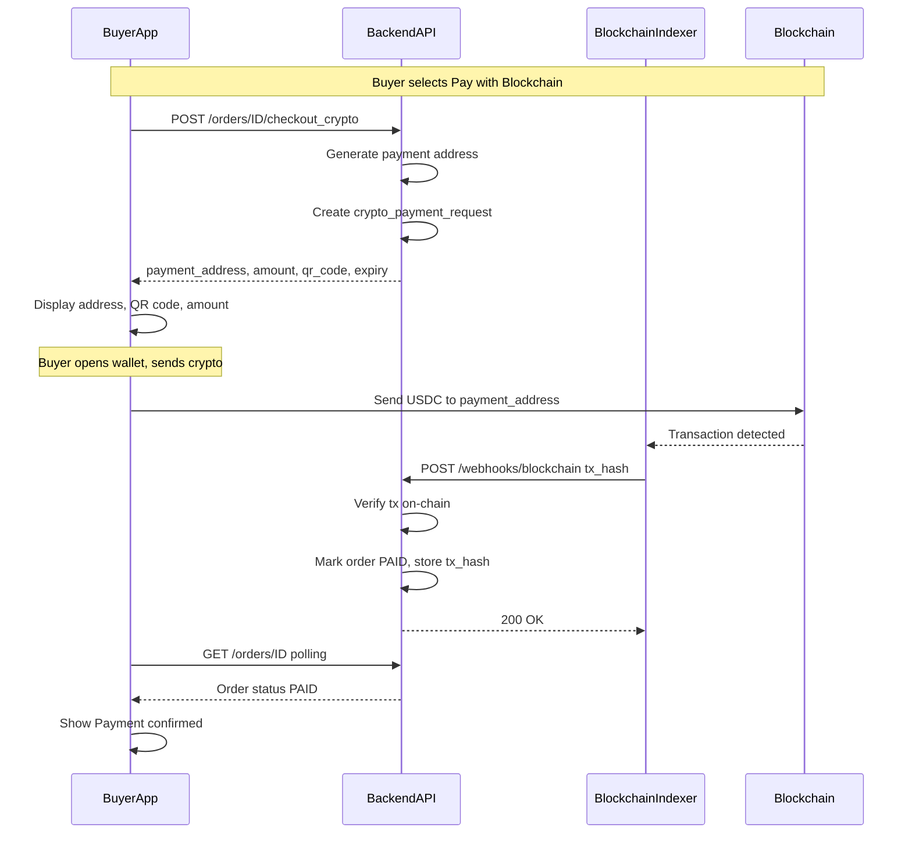
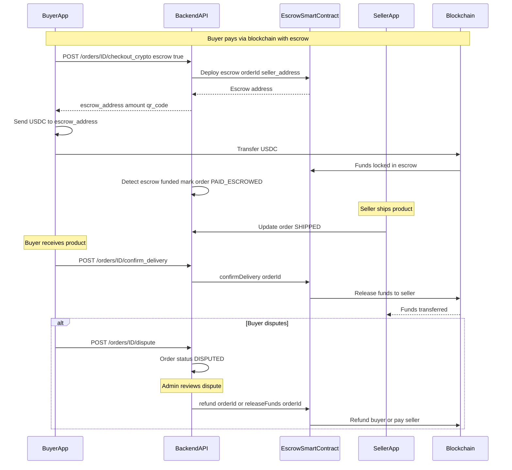
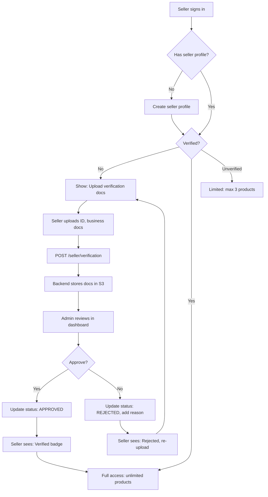
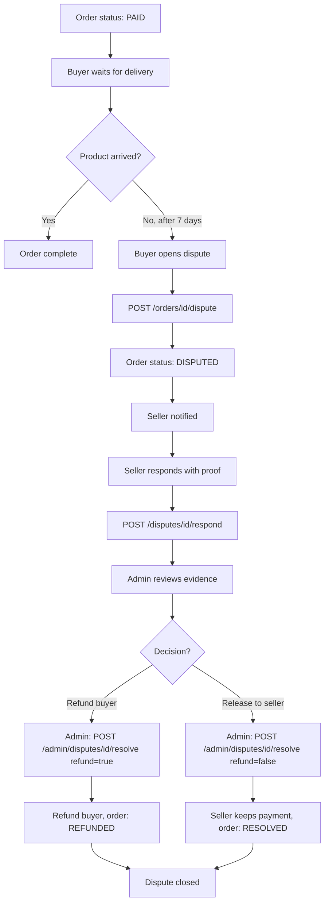
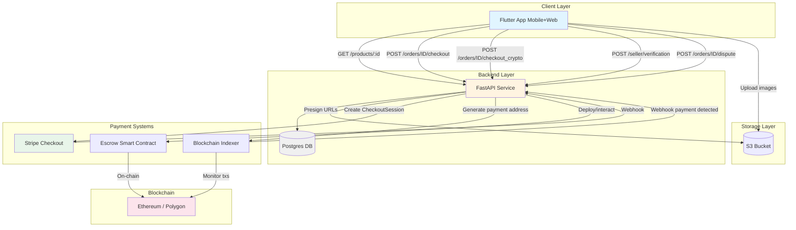
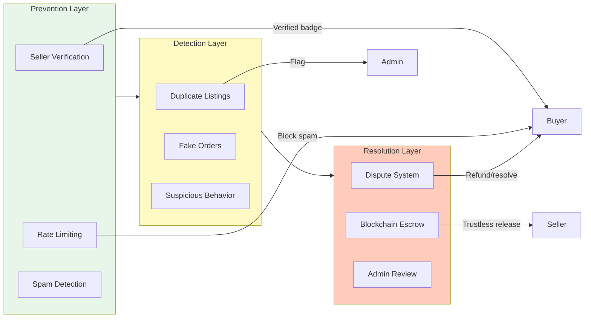

# Phase 2 Architecture Diagrams

## 1) Blockchain payment flow (sequence diagram)

---

## 2) Blockchain escrow flow (with smart contract)

---

## 3) Seller verification workflow

---

## 4) Dispute resolution workflow

---

## 5) Phase 2 system architecture (components)

---

## 6) Anti-scam protection layers

---

## Notes

- **Blockchain indexer options**: Alchemy Notify, QuickNode, Moralis, or self-hosted polling
- **Smart contract audit**: Required before mainnet deployment for escrow
- **Admin dashboard**: Can be simple Flutter web app or separate React/Next.js admin portal
- **Verification KYC**: Consider Stripe Identity, Persona, or Sumsub for automated verification (Phase 3)
